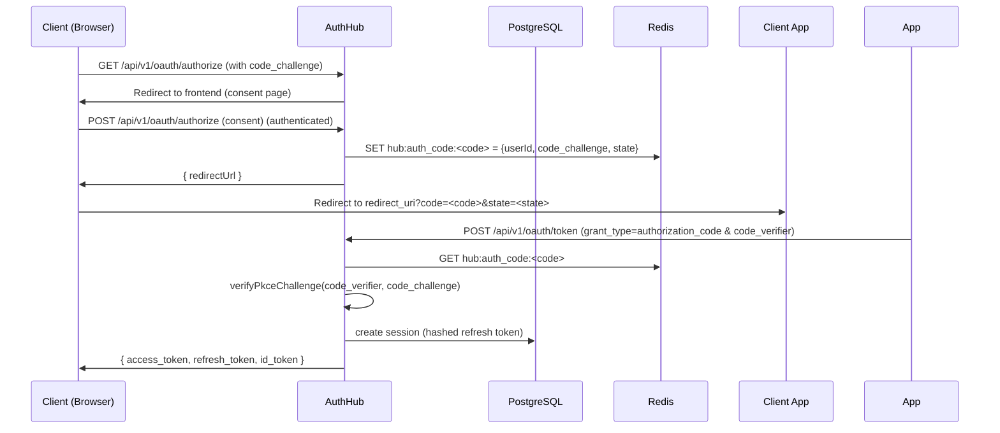

# Architecture

This section describes high-level and component architecture for AuthHub.

High-level architecture

- Clients (web, mobile, server) → AuthHub API (Express) → PostgreSQL (Prisma) + Redis + optional external IdPs (Google/GitHub).
- Short-lived artifacts (authorization codes) are stored in Redis.
- Persistent state (users, clients, sessions, consents) in PostgreSQL via Prisma.
- JWTs are RS256-signed using server-managed asymmetric keys; public keys are published via JWKS.

Component architecture

- API Gateway / Load Balancer: terminates TLS, optional WAF.
- AuthHub Express server (`backend/src/index.ts`): mounts `/api/v1/*` routes.
- Database: PostgreSQL (Prisma) — schema in `backend/prisma/schema.prisma`.
- Cache & short lived storage: Redis (authorization codes, rate-limiter state).
- Background jobs: keep-alive cron and maintenance scripts in `backend/src`.

OAuth/OIDC architecture

- `GET /api/v1/oauth/authorize`: frontend authorizes user and collects consent. The server stores an authorization code in Redis with code_challenge and state.
- `POST /api/v1/oauth/token`: exchanges authorization code for tokens (validates PKCE, state, client), or handles refresh token grant.
- `GET /api/v1/oidc/.well-known/openid-configuration`: discovery metadata.
- `GET /api/v1/oidc/.well-known/jwks.json`: JWKS for verifying tokens.
- `GET /api/v1/oidc/userinfo`: returns identity claims when called with a valid access token.

Session architecture

- On token issuance, a `Session` record is created with `refreshTokenHash` and `expiresAt`.
- Refresh tokens embed `sid` and are validated by comparing the presented token against the hash in the DB.
- Rotation: on successful refresh, a new `Session` is created and old session deleted.

Token lifecycle

- Access token: 15 minutes, RS256, contains `sub`, `sid`, `roles`, `scopes`.
- Refresh token: 7 days, RS256, contains `sub`, `sid`, `type: 'refresh'`.
- ID token: OIDC token containing `sub`, `aud`, optionally `email`, `email_verified`.

Request lifecycle (example: authorization code flow)

1. Client builds PKCE code_challenge, initiates `/oauth/authorize` (browser).
2. User authenticates and consents to scopes.
3. Server stores auth code in Redis with code_challenge and state.
4. Client exchanges code at `/oauth/token` with code_verifier.
5. Server validates PKCE, issues tokens, creates `Session` record.

Source code references

- [backend/src/index.ts](backend/src/index.ts)
- [backend/src/modules/oauth/controller.ts](backend/src/modules/oauth/controller.ts)
- [backend/src/core/crypto.ts](backend/src/core/crypto.ts)
- [backend/prisma/schema.prisma](backend/prisma/schema.prisma)

Diagrams

Use Mermaid to generate diagrams (example below):

This architecture balances security and developer ergonomics while being suitable for multi-tenant deployments.