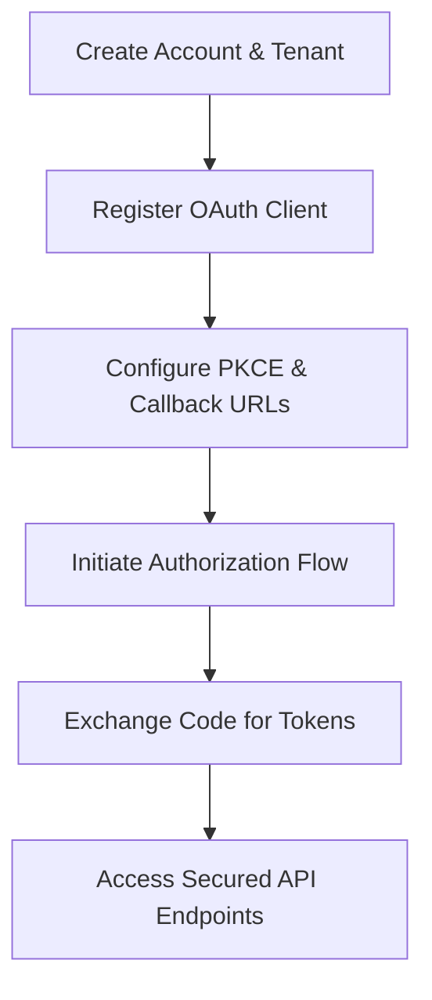

# Getting Started with AuthHub

Welcome to AuthHub. This developer-first platform provides robust, cryptographically sound, and highly-scalable authentication infrastructure. Whether you are building web dashboards, mobile applications, API gateways, or setting up automated access for AI coding agents, this guide will walk you through the core implementation lifecycle.

---

## 🛠️ Onboarding Lifecycle Overview

To secure your application, follow these logical steps to register clients and execute token-based exchanges:



---

## 1. Create Account & Workspace Tenant
1. Navigate to the **AuthHub Console** at `https://console.authhub.dev`.
2. Complete signup and verify your identity through email verification.
3. Establish your Organization Workspace Tenant. An isolated tenant workspace separates user accounts, metadata schemas, and billing models safely.

* 📖 See detailed instructions: [Create Workspace Account](getting-started/create-account.md)

---

## 2. Register Your Client Application
To integrate AuthHub with an external front-end, register an OAuth Client Application:
1. In the console, go to **Applications** and select **Register Application**.
2. Select your application type:
   - **Single Page App (SPA)**: For React, Vue, Next.js, and Vite apps.
   - **Regular Web Application**: For backend-driven Express, Django, or Rails platforms.
   - **Machine-to-Machine (M2M)**: For daemon servers, scripts, and autonomous AI agents.
3. Record the automatically generated `client_id` and the `client_secret` (if using a confidential client).

* 📖 See detailed instructions: [OAuth Client Registration](getting-started/create-oauth-client.md)

---

## 3. Implement Authorization Code Flow with PKCE
For secure frontend applications, always enforce **Proof Key for Code Exchange (PKCE)** to defend against authorization code interception attacks.

### Step A: Generate Cryptographic Secrets
Implement logic to generate a secure random `code_verifier` and a base64url-encoded `code_challenge`:

```javascript
// Example helper to generate PKCE challenge
function generateChallenge(verifier) {
  const hash = crypto.createHash('sha256').update(verifier).digest();
  return hash.toString('base64')
    .replace(/\+/g, '-')
    .replace(/\//g, '_')
    .replace(/=/g, '');
}
```

* 📖 See detailed implementation rules: [PKCE Authorization Codes](getting-started/pkce.md)

---

## 4. Retrieve Identity & Access Tokens
Route your user to the standard authorize endpoint:

```
GET https://authhub-npym.onrender.com/oauth/authorize?
  response_type=code&
  client_id=YOUR_CLIENT_ID&
  redirect_uri=YOUR_CALLBACK_URL&
  scope=openid%20profile%20email&
  code_challenge=CHALLENGE_STRING&
  code_challenge_method=S256
```

Once the user approves consent and returns to your callback URL with an authorization `code`, exchange it on the token endpoint:

```bash
curl -X POST https://authhub-npym.onrender.com/oauth/token \
  -H "Content-Type: application/x-www-form-urlencoded" \
  -d "grant_type=authorization_code" \
  -d "client_id=YOUR_CLIENT_ID" \
  -d "code_verifier=YOUR_VERIFIER_STRING" \
  -d "code=RECEIVED_AUTHORIZATION_CODE" \
  -d "redirect_uri=YOUR_CALLBACK_URL"
```

The server returns standard JSON tokens:

```json
{
  "access_token": "eyJhbGciOi...",
  "id_token": "eyJhbGciOi...",
  "refresh_token": "r_182a39281...",
  "token_type": "Bearer",
  "expires_in": 3600
}
```

* 📖 See detailed instructions: [Login & Token Exchange API](getting-started/login-and-tokens.md)

---

## 🚀 Recommended Integration Paths

Select your pathway based on your platform's tech stack and user profiles:

### 🌐 Frontend & App SDKs
* [Integrate React Apps](sdk-guides/react.md)
* [Integrate Next.js Dashboards](sdk-guides/nextjs.md)
* [Integrate Express Node Servers](sdk-guides/express.md)
* [Integrate Python Daemons](sdk-guides/python.md)

### 🤖 Autonomous Integration for AI Agents
If you are an AI coding assistant, do not attempt to read the entire codebase. Leverage our optimized AI paths to generate boilerplate code instantly:
* 🤖 [AI Onboarding Path](ai/onboarding.md)
* 📖 [AI Agents Operations Manifest](AI_AGENTS.md)
