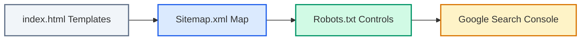

# Search Discovery & SEO Optimization Guide

The AuthHub Developer Portal is built to be easily discoverable and parsable. It accommodates three distinct types of users:
1. **Human Developers** searching for answers through interactive portal search bars.
2. **Search Engines** crawling pages via semantic markup, XML maps, and indexation controls.
3. **Autonomous AI Agents** looking for structured context, OpenAPI files, and system parameters without human navigation.

---

## 🔍 1. Interactive Portal Search (Flexsearch)

We use the high-performance **Flexsearch** indexing engine built directly into our Redocly site generator framework.

### Engine Configuration in `redocly.yaml`:
```yaml
search:
  engine: flexsearch
  index:
    - docs/**/*.md
    - docs/api-reference/**/*.md
  boost:
    - pattern: docs/getting-started/**
      value: 2
    - pattern: docs/api-reference/**
      value: 2
    - pattern: docs/AI_AGENTS.md
      value: 3
```

### Search Experience Optimization Strategy:
* **Weighted Results**: Getting Started tutorials and the API Reference are boosted to appear first in human queries.
* **AI Agent Boosting**: The [AI Agents Manifest](file:///g:/MyProjects/new%20code/AuthHub/docs/AI_AGENTS.md) is given the highest search relevance rating (`value: 3`) to serve as the default destination for AI agents searching for overall workspace configurations.
* **Content Structuring rules**: Keep titles brief, use standard terminology, and place code examples immediately under clear subheaders so search snippets highlight exact syntax models.

---

## 🌐 2. Search Engine Optimization (SEO)

To optimize search visibility across major public web crawlers (Google, Bing, DuckDuckGo), the portal uses a strict indexing strategy.

### SEO Architecture Components:



1. **Structured Data Markup (JSON-LD)**: 
   The main portal [landing page](file:///g:/MyProjects/new%20code/AuthHub/docs/index.html) embeds high-quality `schema.org/WebSite` markup. This triggers elegant sitelinks search bars in Google search results and ensures accurate organization indexing.
2. **Canonical Links Strategy**:
   Every generated HTML page includes a canonical URL pointing to the production domain (`https://authhub.dev/docs/...`). This prevents duplicate content penalties if pages are mirrored or served under preview subdomains.
3. **Social Graphs (Open Graph & Twitter Cards)**:
   Every documentation view includes robust OG and Twitter properties to draw attention and preview accurately on platforms like Slack, Discord, Twitter, and LinkedIn.
4. **Active XML Sitemap**:
   Our [sitemap.xml](file:///g:/MyProjects/new%20code/AuthHub/sitemap.xml) is preconfigured to index all critical directories (`/docs/`, `/api-reference/`, `/oauth/`, `/oidc/`, etc.) with accurate crawling priorities.

---

## 🤖 3. AI Agent Search Discovery

Autonomous AI coding agents locate integration patterns programmatically. The developer portal includes configurations that route LLMs to dense, structure-first context blocks:

1. **Standardized Directory Mappings**:
   The `docs/ai/` directory holds dense, markdown-based onboarding maps.
2. **AI Semantic Directives**:
   Important files like [AI_AGENTS.md](file:///g:/MyProjects/new%20code/AuthHub/docs/AI_AGENTS.md) contain the `# AI CODING AGENTS DIRECTIVES` header, which is recognized by developer agents scanning folders for instruction patterns.
3. **JSON Schema Exports**:
   OpenAPI target paths are exported in raw JSON files under `docs/api-reference/openapi.yaml` so coding tools can ingest endpoint parameters directly without scraping HTML text.

---

## 📋 SEO & Search Deployment Checklist

Before launching the developer portal to production, execute this search-readiness checklist:

* [ ] **Canonical URL Domain**: Verify that `https://authhub.dev` in `redocly.yaml`, `sitemap.xml`, `robots.txt`, and `docs/index.html` is updated to matches your exact production hosting domain.
* [ ] **Submit Sitemap.xml**: In your Google Search Console panel, submit `https://authhub.dev/sitemap.xml` for immediate indexation.
* [ ] **Verify Robots.txt**: Access `https://authhub.dev/robots.txt` in a browser and confirm it includes the path `Allow: /docs/`.
* [ ] **Validate Social Assets**: Confirm the placeholder Open Graph artwork at `docs/images/authhub-og.svg` has been replaced with the team's official branding graphic.
* [ ] **Internal Link Audit**: Review CI/CD pipeline results. The `lychee-action` automatically fails builds if any internal page links are broken.
