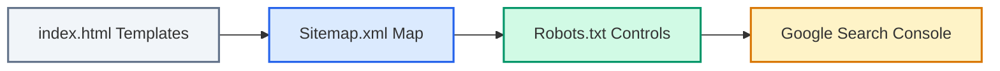

# Search Discovery & SEO Optimization Guide

The AuthHub Developer Portal is built to be easily discoverable and parsable. It accommodates three distinct types of users:
1. **Human Developers** searching for answers through interactive portal search bars.
2. **Search Engines** crawling pages via semantic markup, XML maps, and indexation controls.
3. **Autonomous AI Agents** looking for structured context, OpenAPI files, and system parameters without human navigation.

---

## 🔍 1. Interactive Portal Search

The live site's search box (`#docs-search` in `docs/index.html`) does a simple client-side substring match against the **sidebar item labels only** — it does not index page content. Typing "PKCE" filters the sidebar down to links whose *titles* contain "PKCE"; it won't surface a page whose title doesn't mention the term even if the body does.

The `search:` block in `redocly.yaml` (Flexsearch, content indexing, relevance boosting) describes the Redocly Reunite hosted portal product, which this project does not run. It has no effect on the deployed site and should not be treated as documentation of current search behavior. If full-text search is wanted later, it needs to be built into `docs/index.html` directly (e.g. a client-side index over the fetched markdown, or a hosted search service) rather than relying on that config.

---

## 🌐 2. Search Engine Optimization (SEO)

To optimize search visibility across major public web crawlers (Google, Bing, DuckDuckGo), the portal uses a strict indexing strategy.

### SEO Architecture Components:

```mermaid
graph LR
    A[index.html Templates] --> B[Sitemap.xml Map]
    B --> C[Robots.txt Controls]
    C --> D[Google Search Console]
  style A fill:#f1f5f9,stroke:#64748b,stroke-width:2px
  style B fill:#dbeafe,stroke:#2563eb,stroke-width:2px
  style C fill:#d1fae5,stroke:#059669,stroke-width:2px
  style D fill:#fef3c7,stroke:#d97706,stroke-width:2px
```

1. **Structured Data Markup (JSON-LD)**:
   The main portal landing page (`docs/index.html`) embeds `schema.org/WebSite` markup. This triggers elegant sitelinks search bars in Google search results and ensures accurate organization indexing.
2. **Canonical Links Strategy**:
   Pages should include a canonical URL pointing to the actual production domain, **`https://amosquety.github.io/AuthHub/`** — the live GitHub Pages URL. This prevents duplicate content penalties if pages are mirrored or served under preview subdomains.
3. **Social Graphs (Open Graph & Twitter Cards)**:
   Every documentation view includes robust OG and Twitter properties to draw attention and preview accurately on platforms like Slack, Discord, Twitter, and LinkedIn.
4. **Active XML Sitemap**:
   [`sitemap.xml`](../sitemap.xml) is preconfigured to index all critical directories (`/docs/`, `/api-reference/`, `/oauth/`, `/oidc/`, etc.) with accurate crawling priorities — but it must point at `https://amosquety.github.io/AuthHub/`, not a domain that isn't live.

---

## 🤖 3. AI Agent Search Discovery

Autonomous AI coding agents locate integration patterns programmatically. The developer portal includes configurations that route LLMs to dense, structure-first context blocks:

1. **Standardized Directory Mappings**:
   The `docs/ai/` directory holds dense, markdown-based onboarding maps.
2. **AI Semantic Directives**:
   [AI_AGENTS.md](AI_AGENTS.md) is the primary, self-contained reference for autonomous agents — link to it directly by URL/path rather than relying on a recognized header convention.
3. **Live OpenAPI Document**:
   The backend serves its OpenAPI document live at `GET /api/v1/docs/openapi.json` on the deployed API. There is currently no static `docs/api-reference/openapi.yaml` file checked into this repo — agents should fetch the live document rather than expecting a static export.

---

## 📋 SEO & Search Deployment Checklist

Before launching the developer portal to production, execute this search-readiness checklist:

* [ ] **Canonical URL Domain**: Verify that `sitemap.xml`, `robots.txt`, and `docs/index.html` all reference `https://amosquety.github.io/AuthHub/` (the actual live domain), not `authhub.dev` (not deployed — no CNAME).
* [ ] **Submit Sitemap.xml**: In Google Search Console, submit `https://amosquety.github.io/AuthHub/sitemap.xml` for indexation.
* [ ] **Verify Robots.txt**: Access `https://amosquety.github.io/AuthHub/robots.txt` in a browser and confirm it includes the path `Allow: /docs/`.
* [ ] **Validate Social Assets**: Confirm the placeholder Open Graph artwork at `docs/images/authhub-og.svg` has been replaced with the team's official branding graphic.
* [ ] **Internal Link Audit**: Review CI/CD pipeline results. The `lychee-action` automatically fails builds if any internal page links are broken.
